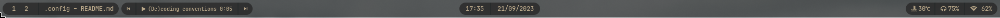

# My dotfiles

--------

## Overview

- **OS** Arch Linux
- **Kernel** 6.5.3
- **WM** Hyprland v0.29.1
- **Terminal** Alacritty
- **Bar** Swaybar
- **Launcher** Wofi

--------

[Start Page](https://github.com/BeauTheBeau/start-page) | [Wallpapers from archlinux-wallpaper](https://roboticoverlords.org/wallpapers/)

## Waybar

### Modules

| Place  | Modules                                                                                                             |
|--------|---------------------------------------------------------------------------------------------------------------------|
| Left   | `hyprland/workspaces`, `hyprland/window`,  `custom/playerctl#prev`, `custom/playerctl`, `custom/playerctl#next` |
| Centre | `clock`, `clock#date`, `tray`                                                                                       |
| Right  | `temperature`, `pulseaudio`, `network`                                                                              |

 [View full image](img/waybar.png)

### Custom modules

#### Playerctl

Uses [waybar/scripts/playerctl.sh](waybar/scripts/playerctl.sh)

| Module name      | Description                                                             |
|------------------|-------------------------------------------------------------------------|
| `playerctl`      | Shows the current song, artist, and how long you've been listening for. |
| `playerctl#prev` | Plays the previous song.                                                |
| `playerctl#next` | Plays the next song.                                                    |

---

## Dependencies

### Main UI
- [Waybar](https://github.com/Alexays/Waybar)
- [Hyprland](https://github.com/hyprwm/Hyprland)
- [Hyprpaper](https://github.com/hyprwm/Hyprpaper)
- [Wofi](https://hg.sr.ht/~scoopta/wofi) - For the launcher (`Super` `R`)

### Other
- [Playerctl](https://github.com/altdesktop/playerctl)
- [Pulseaudio](https://www.freedesktop.org/wiki/Software/PulseAudio/)
- [Grimblast](https://github.com/hyprwm/contrib/tree/main/grimblast) - For screenshots (`Print`)
- [Swappy](https://github.com/jtheoof/swappy) - Screenshot editor
- [Swaylock Effects](https://github.com/mortie/swaylock-effects) - Screen locker

### Fonts
- JetBrains Nerd Font

